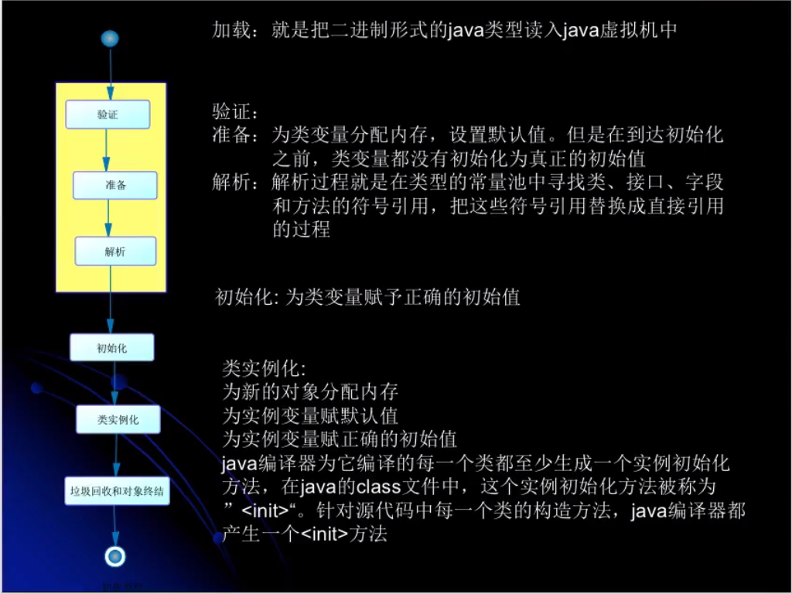

# JVM
- JVM监控工具
   - jconsule
      - 监控内存变化
   - jvisualvm
      - 分析摘要信息
- jvm参数
   - -XX:+optiong，表示开启option选项
   - -XX:-optiong，表示关闭option选项
   - -XX:optiong=value，表示将option选项的值设置为value
   - -XX:+HeapDumpOnOutOfMemoryError -Xms20m -Xmx20m
      - 生成对快照
   - -XX:+TraceClassLoading
      - 用于追踪类的加载信息并打印出来
   - -XX:+TraceClassUnloading
      - 用于追踪类的写在哪信息并打印出来

- 线程共享区
   - 方法区
   - java堆
- 线程独占区
   - 虚拟机栈
   - 本地方法栈
   - 程序计数器

## 类加载器
- 问题
   - 添加问题
- java自带的类加载器
   - 根类加载器(Bootstrap)  --- 加载rt.jar
   - 扩展类加载器(Extension)   --- 加载jre/lib/*.jar
   - 系统(应用)类加载器(System)   --- 加载ClassPath下指定的jar包及目录中的class文件
   - 加载流程如下
- 用户自定义的类加载器
- 定义类加载器
   - 能成功加载类的加载器
- 初始类加载器
   - 能成功返回class的加载器
- 获得类加载器的方法
   - 获得当前类的ClassLoader
   - 获得当前线程上下文的ClassLoader
   - 获得系统的ClassLoader
   - 获得调用者的ClassLoader
- 命名空间
   - 每个类加载器都有自己的命名空间，命名空间有该类加载器及所有父加载器所加载的类构成
   - 在同一个命名空间中，不会出现类的完整名字（包括类的包名）相同的两个类
   - 在不同的命名空间中，有可能出现类的完整名字（包括类的包名）相同的两个类

### 双亲委托机制
- 自底向上检查类是否已经完成加载
- 自顶向下尝试加载类

### 类加载器的工作流程杂记
- 编译
   - 常量在编译阶段会存入到调用这个常量的方法所在的常量池中，本质上，调用类并没有直接引用到定义常量的类，因此并不会触发定义常量类的初始化
   - 当一个常量的值并非编译期间可以确定的，那么其值就不会被放到调用类的常量池中，这时在程序运行时，会导致主动使用这个常量所在的类，显然会导致这个类被初始化
   - 对于数组来说，其类型是有JVM在运行期间动态生成的，表示为[Lcom.pq.xxx这种形式。动态生成的类型，其父类型是Object
   - 对于数组来说，JavaDoc经常将构成数组的元素称为Component，实际上就是将数组降低一个维度后的类型
   - 当一个接口在初始化时，并不要求其父接口都完成了初始化，只有真正的使用到了父接口的时候(如引用接口中所定义的常量时)，才会初始化
- 在java代码中，类型的加载、连接与初始化过程都是在程序运行期间完成的
   - 类的加载
      - 最常见的就是将磁盘上的class文件加载到内存中，将其放到运行时数据区的<font color = red>方法区</font>内，然后在内存中创建一个java.lang.CLass对象，用来封装类在方法区内的<font color=red>数据结构</font>
      - 查找并加载类的二进制数据
   - 连接
      - 验证：确保类被加载类的正确性
      - 准备：为类的<font color=red>静态变量</font>分配内存，并将其初始化为<font color=red>默认值</font>
      - 解析：<font color=red>把类中的符号引用转换为直接引用</font>
   - 初始化
      - 为类的静态变量赋予正确的初始值
   ```java
   class Test{
      // 在连接阶段会给a复制默认值0
      // 在初始化过程，会将1赋值给a
      // 也就是说a = 1是两个过程
      public static final int a = 1;
   }
   ```
   - 类的使用
   - 类的卸载
      - 从内存中卸载
      - 如osgi
      - 有java虚拟机自带的类加载器所加载的类，在虚拟机的生命周期中，始终不会被卸载
      - 由用户自定义的类加载器所加载的类可以被卸载

- 类的加载、连接与初始化过程中，java对类的使用方式(两种)
   - 主动使用(七种，需要从字节码的层面理解最好)
      - 创建类的实例
      - 访问某个类或接口的静态变量，或者对该静态变量赋值
      - 调用类的静态方法
      - 反射
      - 初始化一个类的子类(extend)
      - java虚拟机启动时被标明为启动类的类
      - jdk7开始提供的动态语言支持
   - 被动使用
      - 除了主动使用外的使用，都是被动使用，都不会导致类的初始化
- java助记符
   - getstatic
   - putstatic
   - invokestatic
   - ldc表示将int, float或是string类型的常量值从常量池中推送至栈顶
   - bipush表示将单字节(-128 - 127)的常量值推送至栈顶
   - sipush表示将一个短整型常量值(-32768 - 32767)推送至栈顶
   - iconst_1表示将int类型1推送至栈顶(iconst_m1 ~ iconst_5,-1 ~ 5)
   - anewarray创建一个引用类型(如类，接口，数组)的数组，并将其引用值压入栈顶
   - newarray表示创建一个指定的原始类型(如int，float等)的数组，并将其引用值压入栈顶
   - ...
- 所有的java虚拟机实现必须在每个类或接口被java程序“首次主动使用”时才初始化他们

## java虚拟机与程序的生命周期
- java虚拟机结束生命周期
   - 程序中显示的调用的System.exit()
   - 程序正常执行结束
   - 程序执行过程中遇到错误，异常终止
   - 操作系统出错导致java虚拟机终止